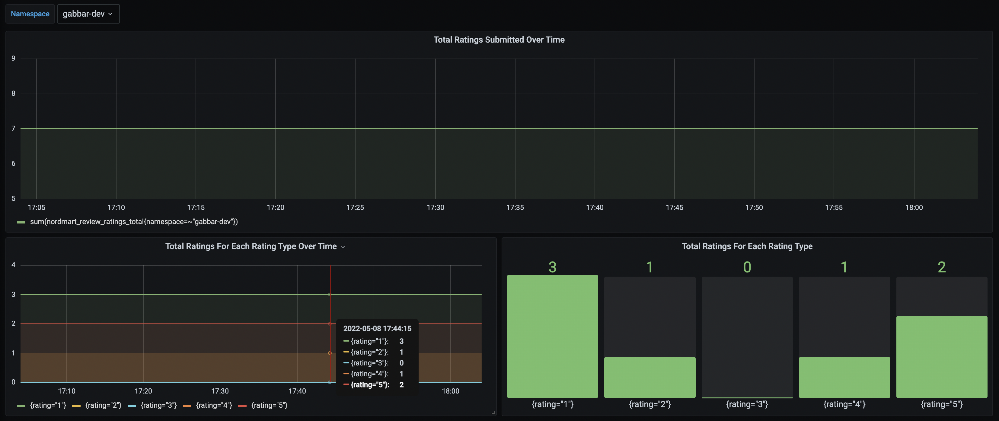

# stakater-nordmart-review

Spring Boot microservice for product review

## Introduction

This project implements review functionality for the products; it provides CRUDS API for reviews.


## User scenarios

### Review Operations

- Add: add a product review
- Delete: delete a product review
- Get: get all reviews for a given product

## Dependencies

It requires following things to be installed:

* Java: ^8.0.
* Maven
* Mongodb

## Dummy Data

Some dummy data is loaded into the system which can be found [here](https://github.com/stakater-lab/stakater-nordmart-review/blob/master/src/main/java/com/stakater/nordmart/service/ReviewServiceImpl.java#L30-L54)

## Deployment strategy

### Local machine

To run the application locally use the command given below:

```bash
mvn clean spring-boot:run
```

### Kubernetes/OpenShift

[Here](https://docs.cloud.stakater.com/content/sre/local-development/tilt/step-by-step-guide.html) is the step by step for local development with Tilt

## APIs

- `/api/review/{productId}`
  - Get a review for the given product id
- `/api/review/{productId}/{customerName}/{rating}/{text}`
  - Add a review for the given product id
- `/api/review/{reviewId}`
  - Delete a review for the given product id

## Configuration

_TODO_

## Test API

Get Review
```bash
curl localhost:8080/api/review/329199
```

Add a Review with Username: bumblebee, ProductId: 329199, Review Rating: 5 and Comment: great
```bash
curl -X POST 'localhost:8080/api/review/329199/bumblebee/5/great'
```

Delete a Review with reviewId: 6277b5c05c21830faf89a3bf
```bash
curl -X DELETE localhost:8080/api/review/6277b5c05c21830faf89a3bf
```

## Alerts & Monitoring

A grafana dashboard is setup to display the number of reviews overtime. The trend can be viewed by adding more reviews using the add API



An Alertmanager rule is setup to send alerts if the total rating <= 2 goes beyond 5

## DevSecOps scans

tooling:
- trivy
- rhacs 
- stackrox
- checkov
- sonar


